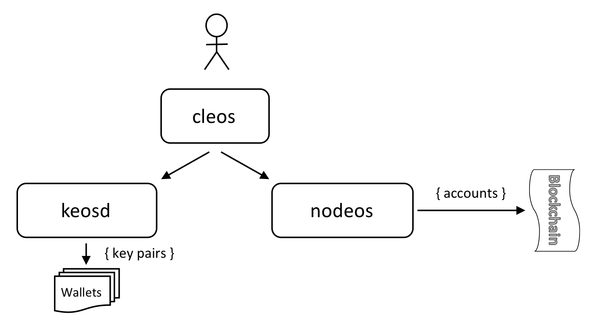

# 账户&钱包综合指南

**注意：**本教程适用于私有单节点测试网络，但是仅稍作修改就可以运行在公用测试网络中。

## 1.引言

### 1.教程适用人群

本教程适用于想了解一下功能的人群：

1. 了解钱包和账户管理

2. 如何适用`cleos`来管理钱包和账户

3. 钱包和账户管理的EOSIO组件如何相互

更多的信息需要参考命令行指南文章

[https://developers.eos.io/eosio-cleos/reference](https://developers.eos.io/eosio-cleos/reference "Command Reference")

### 2.你将会学到的内容

你将学会如何创建和管理钱包极其秘钥，然后使用该钱包通过`cleos`去跟区块链交互。将会学到通过`cleos`来创建账户。教程中还会介绍`cleos`,`keosd`,`nodeos`之间的交互来签署一些信息并发布到区块链上面。

### 3.前提条件

1. 在系统上构建并运行cleos和keosd的副本
2. 构建并准备好在系统中运行nodeos的副本
3. 对命令行接口的基本了解

**注意：** 指令应用在docker安装中需要做稍微的修改。

## 2.EOSIO账户和钱包概念简介

下图展示了EOSIO账户和钱包的简单概念。EOSIO不仅仅支持图中的这些简单概念，还支持很多其他的部署配置，这篇文章我们介绍跟图中相关的使用。

钱包可以理解为一堆公私钥的存储，这些需要在区块链上面执行签名操作。钱包及其内容通过`keosd`管理，通过`cleos`访问钱包。
账户可以理解为链上关联访问权限的一个标识符（即安全主体）。`nodeos`管理账户及其相关操作在链上的发布，账户管理功能也可以使用`cleos`。

钱包和账户之间没有本身就约定的关系。账户并不知道钱包的存在，反之亦然。相应的，`nodeos`和`keosd`之间也没有根本关联。他们的基本功能从根本上讲是不同的（话虽如此，但是可以通过部署配置来模糊他们之间的区别。当然，这个话题已经超出了我们本节课的范围）。

在发生重复（overlap-需要等待新的理解）时需要签名，例如，签名交易。钱包通过将秘钥存储在你自己可以锁住的加密存储柜中来获得安全的签名。`cleos`可以很好的充当一个中介，用来给`keosd`检索秘钥和需要这些秘钥进行签名的`nodeos`账户操作。

## 3.　创建和管理钱包

打开命令行并切换到已经编译好的eosio源码中，我们可以通过`cleos`命令很简单的来和`nodeos`和`keosd`交互。

在运行`cleos`前，需要注意的一点就是你需要先一个`keosd`的实例用来交互，并且可以通过一个参数来初始化`keosd`实例。

	cd /path_to_eos/build/programs/cleos

首先要做的就是来创建一个钱包，通过`cleos`中的`wallet create`命令。

	$ cleos wallet create
	Creating wallet: default
	Save password to use in the future to unlock this wallet.
	Without password imported keys will not be retrievable.
	"A MASTER PASSWORD"
	

	
