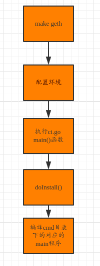

## Ethereum 编译源码简要分析

从编译开始，做一下简要源码分析。

## Geth -- the go-ethereum command line interface

编译 Geth

	make geth

会在go-ethereum/build/bin 目录下面生成 geth 

首先看下 Makefile 文件：

	geth:
		build/env.sh go run build/ci.go install ./cmd/geth
		@echo "Done building."
		@echo "Run \"$(GOBIN)/geth\" to launch geth."

build/env.sh go主要配置一些环境。

ci.go main:

	func main() {
		log.SetFlags(log.Lshortfile)

		if _, err := os.Stat(filepath.Join("build", "ci.go")); os.IsNotExist(err) {
			log.Fatal("this script must be run from the root of the repository")
		}
		if len(os.Args) < 2 {
			log.Fatal("need subcommand as first argument")
		}
		switch os.Args[1] {
		case "install":
			doInstall(os.Args[2:]) // install 调用这里
		case "test":
			doTest(os.Args[2:])
		case "lint":
			doLint(os.Args[2:])
		case "archive":
			doArchive(os.Args[2:])
		case "debsrc":
			doDebianSource(os.Args[2:])
		case "nsis":
			doWindowsInstaller(os.Args[2:])
		case "aar":
			doAndroidArchive(os.Args[2:])
		case "xcode":
			doXCodeFramework(os.Args[2:])
		case "xgo":
			doXgo(os.Args[2:])
		case "purge":
			doPurge(os.Args[2:])
		default:
			log.Fatal("unknown command ", os.Args[1])
		}
	}

doInstall() :

	func doInstall(cmdline []string) {
		var (
			arch = flag.String("arch", "", "Architecture to cross build for")
			cc   = flag.String("cc", "", "C compiler to cross build with")
		)
		flag.CommandLine.Parse(cmdline)
		env := build.Env()

		// Check Go version. People regularly open issues about compilation
		// failure with outdated Go. This should save them the trouble.
		if !strings.Contains(runtime.Version(), "devel") {
			// Figure out the minor version number since we can't textually compare (1.10 < 1.9)
			var minor int
			fmt.Sscanf(strings.TrimPrefix(runtime.Version(), "go1."), "%d", &minor)

			if minor < 9 {
				log.Println("You have Go version", runtime.Version())
				log.Println("go-ethereum requires at least Go version 1.9 and cannot")
				log.Println("be compiled with an earlier version. Please upgrade your Go installation.")
				os.Exit(1)
			}
		}
		// Compile packages given as arguments, or everything if there are no arguments.
		packages := []string{"./..."}
		if flag.NArg() > 0 {
			packages = flag.Args()
		}
		packages = build.ExpandPackagesNoVendor(packages)

		if *arch == "" || *arch == runtime.GOARCH {
			goinstall := goTool("install", buildFlags(env)...)
			goinstall.Args = append(goinstall.Args, "-v")
			goinstall.Args = append(goinstall.Args, packages...)
			build.MustRun(goinstall)
			return
		}
		// If we are cross compiling to ARMv5 ARMv6 or ARMv7, clean any previous builds
		if *arch == "arm" {
			os.RemoveAll(filepath.Join(runtime.GOROOT(), "pkg", runtime.GOOS+"_arm"))
			for _, path := range filepath.SplitList(build.GOPATH()) {
				os.RemoveAll(filepath.Join(path, "pkg", runtime.GOOS+"_arm"))
			}
		}
		// Seems we are cross compiling, work around forbidden GOBIN
		goinstall := goToolArch(*arch, *cc, "install", buildFlags(env)...)
		goinstall.Args = append(goinstall.Args, "-v")
		goinstall.Args = append(goinstall.Args, []string{"-buildmode", "archive"}...)
		goinstall.Args = append(goinstall.Args, packages...)
		build.MustRun(goinstall)

		if cmds, err := ioutil.ReadDir("cmd"); err == nil {
			for _, cmd := range cmds {
				pkgs, err := parser.ParseDir(token.NewFileSet(), filepath.Join(".", "cmd", cmd.Name()), nil, parser.PackageClauseOnly)
				if err != nil {
					log.Fatal(err)
				}
				for name := range pkgs {
					if name == "main" {
						gobuild := goToolArch(*arch, *cc, "build", buildFlags(env)...)
						gobuild.Args = append(gobuild.Args, "-v")
						gobuild.Args = append(gobuild.Args, []string{"-o", executablePath(cmd.Name())}...)
						gobuild.Args = append(gobuild.Args, "."+string(filepath.Separator)+filepath.Join("cmd", cmd.Name()))
						build.MustRun(gobuild)
						break
					}
				}
			}
		}
	}	
	
在这个函数里面会去 循环cmd目录下的所有包，并查找对应的main包进行编译。

make all 也是相同的流程

## 简要流程图
 

