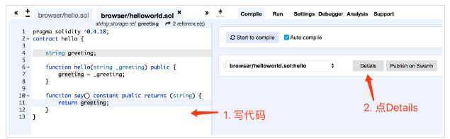
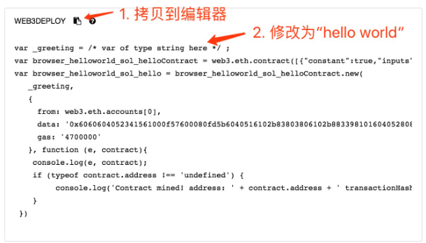

## 1. 环境启动

geth是一个以太坊客户端，用geth启动一个以太坊（开发者）节点。

命令：
	geth --datadir testNet --dev console 2>>test.log
	
执行后效果如下：

	gonglt1@gonglt1-ThinkCentre-M8600s-N000:~/work/test/ethreum$ geth --datadir testNet --dev console 2>>test.log
	Welcome to the Geth JavaScript console!

	instance: Geth/v1.7.3-stable-4bb3c89d/linux-amd64/go1.9
	coinbase: 0x816c7135aa22d24826598b6bbfbce2f1fc3225a5
	at block: 0 (Thu, 01 Jan 1970 08:00:00 CST)
	 datadir: /home/gonglt1/work/test/ethreum/testNet
	 modules: admin:1.0 clique:1.0 debug:1.0 eth:1.0 miner:1.0 net:1.0 personal:1.0 rpc:1.0 shh:1.0 txpool:1.0 web3:1.0

	> 

**命令参数说明:**

–dev 启用开发者网络（模式），开发者网络会使用POA共识，默认预分配一个开发者账户并且会自动开启挖矿。

–datadir 后面的参数是区块数据及秘钥存放目录。第一次输入命令后，它会放在当前目录下新建一个testNet目录来存放数据。

console 进入控制台

2>> test.log 表示把控制台日志输出到test.log文件

实时查看日志：

另启动一个 终端，执行

	tail -f test.log
	
## 2. 准备账户

**查看默认分配的开发者账户**

	> eth.accounts
	或者
	> personal.listAccounts

执行结果 ：

	> eth.accounts
	["0x816c7135aa22d24826598b6bbfbce2f1fc3225a5"]

**查看账户余额：**

	> eth.getBalance(eth.accounts[0])
	1.15792089237316195423570985008687907853269984665640564039457584007913129639927e+77

eth.accounts[0]表示账户列表第一个账户

**创建一个新的账户：**

	> personal.newAccount("TinyXiong")
	"0x39fe56c513ad085c49ccf3632082f4d644fa6233"
	> eth.accounts
	["0x816c7135aa22d24826598b6bbfbce2f1fc3225a5", "0x39fe56c513ad085c49ccf3632082f4d644fa6233"]
	> eth.getBalance(eth.accounts[1])
	0
	> personal.listAccounts
	["0x816c7135aa22d24826598b6bbfbce2f1fc3225a5", "0x39fe56c513ad085c49ccf3632082f4d644fa6233"]

## 3.转账

	> eth.sendTransaction({from: '0x816c7135aa22d24826598b6bbfbce2f1fc3225a5', to: '0x39fe56c513ad085c49ccf3632082f4d644fa6233', value: web3.toWei(1, "ether")})
	"0xb1e53cf2af6161f8da0d260f30e3c3ccaa4b0873e6f5d1d2cec8665be45317ef"
	> eth.getBalance(eth.accounts[1])
	1000000000000000000

执行转账可以看到挖矿日志：

	INFO [05-09|21:28:48] Submitted transaction                    fullhash=0xb1e53cf2af6161f8da0d260f30e3c3ccaa4b0873e6f5d1d2cec8665be45317ef recipient=0x39fE56c513aD085c49Ccf3632082F4d644fa6233
	INFO [05-09|21:28:48] Commit new mining work                   number=1 txs=1 uncles=0 elapsed=904.021µs
	INFO [05-09|21:28:48] Successfully sealed new block            number=1 hash=dfed3f…704849
	INFO [05-09|21:28:48] 🔨 mined potential block                  number=1 hash=dfed3f…704849
	INFO [05-09|21:28:48] Commit new mining work                   number=2 txs=0 uncles=0 elapsed=1.174ms
	WARN [05-09|21:28:48] Block sealing failed                     err="waiting for transactions"

## 4.解锁账户

	> personal.unlockAccount(eth.accounts[1],"TinyXiong")
	true

“TinyXiong” 是之前创建账户时的密码

## 5.编写 合约代码 “hello world”

hello world 代码：

	pragma solidity ^0.4.18;
	contract hello {
	    string greeting;
	    
	    function hello(string _greeting) public {
		greeting = _greeting;
	    }

	    function say() constant public returns (string) {
		return greeting;
	    }
	}

solidity 环境： [Browser-Solidity](http://remix.ethereum.org/#optimize=false&version=soljson-v0.4.23+commit.124ca40d.js) 

部署步骤：

拷贝出来修改后的的结果：

	var _greeting = "Hello world!"/* var of type string here */ ;
	var helloContract = web3.eth.contract([{"constant":true,"inputs":[],"name":"say","outputs":[{"name":"","type":"string"}],"payable":false,"stateMutability":"view","type":"function"},{"inputs":[{"name":"_greeting","type":"string"}],"payable":false,"stateMutability":"nonpayable","type":"constructor"}]);
	var hello = helloContract.new(
	   _greeting,
	   {
	     from: web3.eth.accounts[1], 
	     data: '0x608060405234801561001057600080fd5b506040516102a83803806102a8833981018060405281019080805182019291905050508060009080519060200190610049929190610050565b50506100f5565b828054600181600116156101000203166002900490600052602060002090601f016020900481019282601f1061009157805160ff19168380011785556100bf565b828001600101855582156100bf579182015b828111156100be5782518255916020019190600101906100a3565b5b5090506100cc91906100d0565b5090565b6100f291905b808211156100ee5760008160009055506001016100d6565b5090565b90565b6101a4806101046000396000f300608060405260043610610041576000357c0100000000000000000000000000000000000000000000000000000000900463ffffffff168063954ab4b214610046575b600080fd5b34801561005257600080fd5b5061005b6100d6565b6040518080602001828103825283818151815260200191508051906020019080838360005b8381101561009b578082015181840152602081019050610080565b50505050905090810190601f1680156100c85780820380516001836020036101000a031916815260200191505b509250505060405180910390f35b606060008054600181600116156101000203166002900480601f01602080910402602001604051908101604052809291908181526020018280546001816001161561010002031660029004801561016e5780601f106101435761010080835404028352916020019161016e565b820191906000526020600020905b81548152906001019060200180831161015157829003601f168201915b50505050509050905600a165627a7a72305820975fe0ad447b8e15080e3ff4ac65eede7abd1fa12f713deccb71971942faf9d10029', 
	     gas: '4700000'
	   }, function (e, contract){
	    console.log(e, contract);
	    if (typeof contract.address !== 'undefined') {
		 console.log('Contract mined! address: ' + contract.address + ' transactionHash: ' + contract.transactionHash);
	    }
	 })

将这段修改后的代码copy到geth 控制台里面，查看结果：

	> personal.unlockAccount(eth.accounts[1],"TinyXiong")
	true
	> var _greeting = "Hello world!"/* var of type string here */ ;
	undefined
	> var helloContract = web3.eth.contract([{"constant":true,"inputs":[],"name":"say","outputs":[{"name":"","type":"string"}],"payable":false,"stateMutability":"view","type":"function"},{"inputs":[{"name":"_greeting","type":"string"}],"payable":false,"stateMutability":"nonpayable","type":"constructor"}]);
	undefined
	> var hello = helloContract.new(
	...    _greeting,
	...    {
	......      from: web3.eth.accounts[1], 
	......      data: '0x608060405234801561001057600080fd5b506040516102a83803806102a8833981018060405281019080805182019291905050508060009080519060200190610049929190610050565b50506100f5565b828054600181600116156101000203166002900490600052602060002090601f016020900481019282601f1061009157805160ff19168380011785556100bf565b828001600101855582156100bf579182015b828111156100be5782518255916020019190600101906100a3565b5b5090506100cc91906100d0565b5090565b6100f291905b808211156100ee5760008160009055506001016100d6565b5090565b90565b6101a4806101046000396000f300608060405260043610610041576000357c0100000000000000000000000000000000000000000000000000000000900463ffffffff168063954ab4b214610046575b600080fd5b34801561005257600080fd5b5061005b6100d6565b6040518080602001828103825283818151815260200191508051906020019080838360005b8381101561009b578082015181840152602081019050610080565b50505050905090810190601f1680156100c85780820380516001836020036101000a031916815260200191505b509250505060405180910390f35b606060008054600181600116156101000203166002900480601f01602080910402602001604051908101604052809291908181526020018280546001816001161561010002031660029004801561016e5780601f106101435761010080835404028352916020019161016e565b820191906000526020600020905b81548152906001019060200180831161015157829003601f168201915b50505050509050905600a165627a7a72305820975fe0ad447b8e15080e3ff4ac65eede7abd1fa12f713deccb71971942faf9d10029', 
	......      gas: '4700000'
	......    }, function (e, contract){
	......     console.log(e, contract);
	......     if (typeof contract.address !== 'undefined') {
	.........          console.log('Contract mined! address: ' + contract.address + ' transactionHash: ' + contract.transactionHash);
	.........     }
	......  })
	null [object Object]
	undefined
	> null [object Object]
	Contract mined! address: 0xbee959086338776a87eeb929a2f193265b2b5be7 transactionHash: 0x4cc70926f5014f0e4f0a54a4bedc359bd5de8ec72ad38a28c6ec45c061750aee

运行日志：

	INFO [05-10|08:50:41] Submitted contract creation              fullhash=0xe917f2b62b09042a1bafd47db7474416e5fb3322af315643334c09924a7ea252 contract=0x2c1cd2aa2c97859450678e73E81DcF6aB39c8C75
	INFO [05-10|08:50:41] Commit new mining work                   number=5 txs=1 uncles=0 elapsed=296.876µs
	INFO [05-10|08:50:41] Successfully sealed new block            number=5 hash=13b0c0…ec2ca8
	INFO [05-10|08:50:41] 🔨 mined potential block                  number=5 hash=13b0c0…ec2ca8
	INFO [05-10|08:50:41] Commit new mining work                   number=6 txs=0 uncles=0 elapsed=287.115µs
	WARN [05-10|08:50:41] Block sealing failed                     err="waiting for transactions"

查看余额：

	> eth.getBalance(eth.accounts[1])
	999999999999191922
	> 

运行合约：

	> hello
	{
	  abi: [{
	      constant: true,
	      inputs: [],
	      name: "say",
	      outputs: [{...}],
	      payable: false,
	      stateMutability: "view",
	      type: "function"
	  }, {
	      inputs: [{...}],
	      payable: false,
	      stateMutability: "nonpayable",
	      type: "constructor"
	  }],
	  address: "0x2c1cd2aa2c97859450678e73e81dcf6ab39c8c75",
	  transactionHash: "0xe917f2b62b09042a1bafd47db7474416e5fb3322af315643334c09924a7ea252",
	  allEvents: function(),
	  say: function()
	}
	> hello.say()
	"Hello world!"

