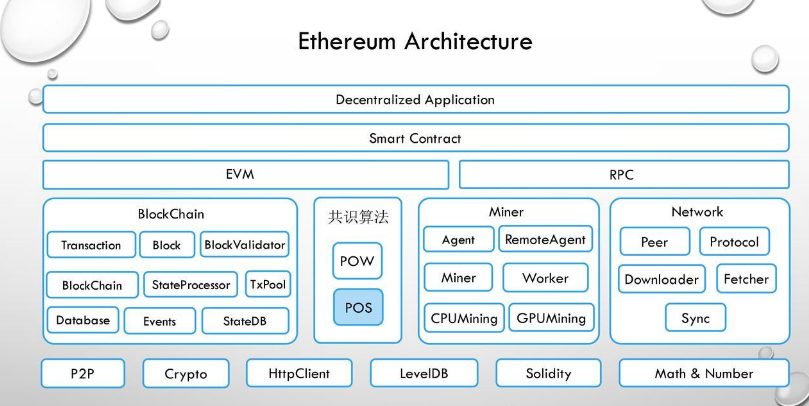

## 1.Ethereum Architechture

从网上借用的图片：

## 2.block

位置：core/types/block.go

	// Block represents an entire block in the Ethereum blockchain.
	type Block struct {
		header       *Header
		uncles       []*Header
		transactions Transactions

		// caches
		hash atomic.Value
		size atomic.Value

		// Td is used by package core to store the total difficulty
		// of the chain up to and including the block.
		td *big.Int

		// These fields are used by package eth to track
		// inter-peer block relay.
		ReceivedAt   time.Time
		ReceivedFrom interface{}
	}
	

	// Header represents a block header in the Ethereum blockchain.
	type Header struct {
		ParentHash  common.Hash    `json:"parentHash"       gencodec:"required"` // Hash to the previous block
		UncleHash   common.Hash    `json:"sha3Uncles"       gencodec:"required"` // Uncles of this block
		Coinbase    common.Address `json:"miner"            gencodec:"required"` // the coin base address
		Root        common.Hash    `json:"stateRoot"        gencodec:"required"` // Block Trie state
		TxHash      common.Hash    `json:"transactionsRoot" gencodec:"required"` // Tx SHA
		ReceiptHash common.Hash    `json:"receiptsRoot"     gencodec:"required"`// Receipt SHA
		Bloom       Bloom          `json:"logsBloom"        gencodec:"required"` // Bloom
		Difficulty  *big.Int       `json:"difficulty"       gencodec:"required"` //Difficulty for the current block
		Number      *big.Int       `json:"number"           gencodec:"required"` //The block Number
		GasLimit    uint64         `json:"gasLimit"         gencodec:"required"` //Gas Limit
		GasUsed     uint64         `json:"gasUsed"          gencodec:"required"` //Gas Used
		Time        *big.Int       `json:"timestamp"        gencodec:"required"` // Creation Time
		Extra       []byte         `json:"extraData"        gencodec:"required"`// Extra data
		MixDigest   common.Hash    `json:"mixHash"          gencodec:"required"` //for quick difficulty verification
		Nonce       BlockNonce     `json:"nonce"            gencodec:"required"`
	}
	
**Trie:**Trie树，又叫字典树、前缀树（Prefix Tree）、单词查找树 或 键树，是一种多叉树结构.Trie树的核心思想是空间换时间，利用字符串的公共前缀来减少无谓的字符串比较以达到提高查询效率的目的。
**参考链接：**[Trie树（Prefix Tree）介绍](https://blog.csdn.net/lisonglisonglisong/article/details/45584721)

**Bloom:**

 Bloom Filter是一种空间效率很高的随机数据结构，它的原理是，当一个元素被加入集合时，通过K个Hash函数将这个元素映射成一个位阵列（Bit array）中的K个点，把它们置为1。检索时，我们只要看看这些点是不是都是1就（大约）知道集合中有没有它了：如果这些点有任何一个0，则被检索元素一定不在；如果都是1，则被检索元素很可能在。这就是布隆过滤器的基本思想。

 但Bloom Filter的这种高效是有一定代价的：在判断一个元素是否属于某个集合时，有可能会把不属于这个集合的元素误认为属于这个集合（false positive）。因此，Bloom Filter不适合那些“零错误”的应用场合。而在能容忍低错误率的应用场合下，Bloom Filter通过极少的错误换取了存储空间的极大节省。

  有人可能想知道它的中文叫法，倒是有被译作称布隆过滤器。该不该译，译的是否恰当，由诸君品之。下文之中，如果有诸多公式不慎理解，也无碍，只作稍稍了解即可。

## 3.Transaction

位置：core/types/transaction.go

	type Transaction struct {
		data txdata
		// caches
		hash atomic.Value
		size atomic.Value
		from atomic.Value
	}

	type txdata struct {
		AccountNonce uint64          `json:"nonce"    gencodec:"required"`
		Price        *big.Int        `json:"gasPrice" gencodec:"required"`
		GasLimit     uint64          `json:"gas"      gencodec:"required"`
		Recipient    *common.Address `json:"to"       rlp:"nil"` // nil means contract creation
		Amount       *big.Int        `json:"value"    gencodec:"required"`
		Payload      []byte          `json:"input"    gencodec:"required"`

		// Signature values
		V *big.Int `json:"v" gencodec:"required"`
		R *big.Int `json:"r" gencodec:"required"`
		S *big.Int `json:"s" gencodec:"required"`

		// This is only used when marshaling to JSON.
		Hash *common.Hash `json:"hash" rlp:"-"`
	}

1.Contract creation transaction 的区别：Recipient == nil ; (Recipient  接受者)

2.Transaction 能以RLP算法进行 Encode 和Decode

3.hash/size/from 字段是cache之用，避免多次hash/sign导致性能损失

