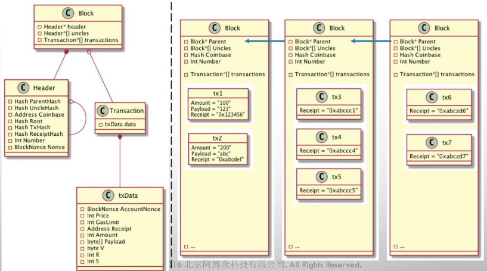
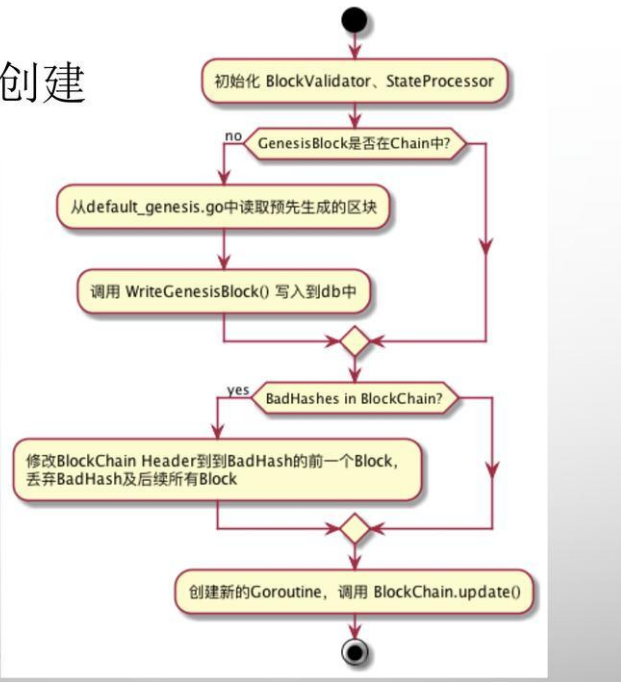
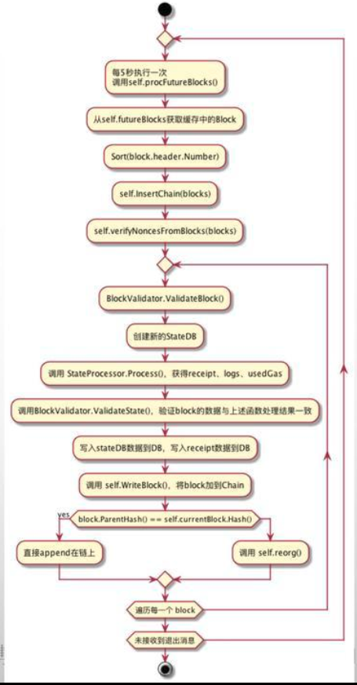
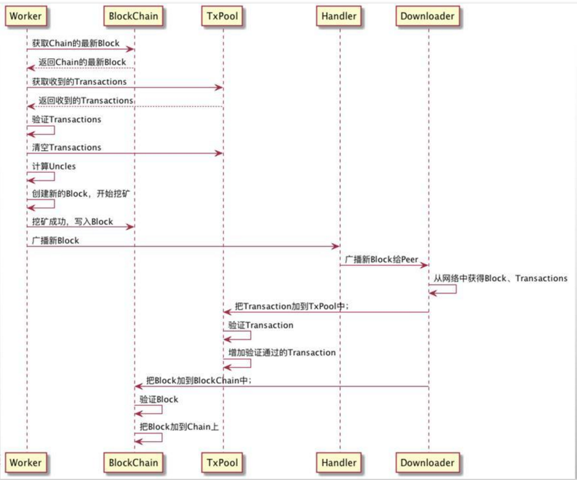

## 1.Ethereum Architechture

从网上借用的图片：

## 2.block

位置：core/types/block.go

	// Block represents an entire block in the Ethereum blockchain.
	type Block struct {
		header       *Header
		uncles       []*Header
		transactions Transactions

		// caches
		hash atomic.Value
		size atomic.Value

		// Td is used by package core to store the total difficulty
		// of the chain up to and including the block.
		td *big.Int

		// These fields are used by package eth to track
		// inter-peer block relay.
		ReceivedAt   time.Time
		ReceivedFrom interface{}
	}
	

	// Header represents a block header in the Ethereum blockchain.
	type Header struct {
		ParentHash  common.Hash    `json:"parentHash"       gencodec:"required"` // Hash to the previous block
		UncleHash   common.Hash    `json:"sha3Uncles"       gencodec:"required"` // Uncles of this block
		Coinbase    common.Address `json:"miner"            gencodec:"required"` // the coin base address
		Root        common.Hash    `json:"stateRoot"        gencodec:"required"` // Block Trie state
		TxHash      common.Hash    `json:"transactionsRoot" gencodec:"required"` // Tx SHA
		ReceiptHash common.Hash    `json:"receiptsRoot"     gencodec:"required"`// Receipt SHA
		Bloom       Bloom          `json:"logsBloom"        gencodec:"required"` // Bloom
		Difficulty  *big.Int       `json:"difficulty"       gencodec:"required"` //Difficulty for the current block
		Number      *big.Int       `json:"number"           gencodec:"required"` //The block Number
		GasLimit    uint64         `json:"gasLimit"         gencodec:"required"` //Gas Limit
		GasUsed     uint64         `json:"gasUsed"          gencodec:"required"` //Gas Used
		Time        *big.Int       `json:"timestamp"        gencodec:"required"` // Creation Time
		Extra       []byte         `json:"extraData"        gencodec:"required"`// Extra data
		MixDigest   common.Hash    `json:"mixHash"          gencodec:"required"` //for quick difficulty verification
		Nonce       BlockNonce     `json:"nonce"            gencodec:"required"`
	}
	
**Trie:**Trie树，又叫字典树、前缀树（Prefix Tree）、单词查找树 或 键树，是一种多叉树结构.Trie树的核心思想是空间换时间，利用字符串的公共前缀来减少无谓的字符串比较以达到提高查询效率的目的。
**参考链接：**[Trie树（Prefix Tree）介绍](https://blog.csdn.net/lisonglisonglisong/article/details/45584721)

**Bloom:**

 Bloom Filter是一种空间效率很高的随机数据结构，它的原理是，当一个元素被加入集合时，通过K个Hash函数将这个元素映射成一个位阵列（Bit array）中的K个点，把它们置为1。检索时，我们只要看看这些点是不是都是1就（大约）知道集合中有没有它了：如果这些点有任何一个0，则被检索元素一定不在；如果都是1，则被检索元素很可能在。这就是布隆过滤器的基本思想。

 但Bloom Filter的这种高效是有一定代价的：在判断一个元素是否属于某个集合时，有可能会把不属于这个集合的元素误认为属于这个集合（false positive）。因此，Bloom Filter不适合那些“零错误”的应用场合。而在能容忍低错误率的应用场合下，Bloom Filter通过极少的错误换取了存储空间的极大节省。

  有人可能想知道它的中文叫法，倒是有被译作称布隆过滤器。该不该译，译的是否恰当，由诸君品之。下文之中，如果有诸多公式不慎理解，也无碍，只作稍稍了解即可。

## 3.Transaction

位置：core/types/transaction.go

	type Transaction struct {
		data txdata
		// caches
		hash atomic.Value
		size atomic.Value
		from atomic.Value
	}

	type txdata struct {
		AccountNonce uint64          `json:"nonce"    gencodec:"required"`
		Price        *big.Int        `json:"gasPrice" gencodec:"required"`
		GasLimit     uint64          `json:"gas"      gencodec:"required"`
		Recipient    *common.Address `json:"to"       rlp:"nil"` // nil means contract creation
		Amount       *big.Int        `json:"value"    gencodec:"required"`
		Payload      []byte          `json:"input"    gencodec:"required"`

		// Signature values
		V *big.Int `json:"v" gencodec:"required"`
		R *big.Int `json:"r" gencodec:"required"`
		S *big.Int `json:"s" gencodec:"required"`

		// This is only used when marshaling to JSON.
		Hash *common.Hash `json:"hash" rlp:"-"`
	}

1.Contract creation transaction 的区别：Recipient == nil ; (Recipient  接受者)

2.Transaction 能以RLP算法进行 Encode 和Decode

3.hash/size/from 字段是cache之用，避免多次hash/sign导致性能损失

区块图例：

## 4.BlockChain

位置： core/blockchain.go

	type BlockChain struct {
		config *params.ChainConfig // chain & network configuration

		hc            *HeaderChain
		chainDb       ethdb.Database //本地数据库
		rmLogsFeed    event.Feed
		chainFeed     event.Feed
		chainSideFeed event.Feed
		chainHeadFeed event.Feed
		logsFeed      event.Feed
		scope         event.SubscriptionScope
		genesisBlock  *types.Block

		mu      sync.RWMutex // global mutex for locking chain operations
		chainmu sync.RWMutex // blockchain insertion lock
		procmu  sync.RWMutex // block processor lock

		checkpoint       int          // checkpoint counts towards the new checkpoint
		currentBlock     *types.Block // Current head of the block chain
		currentFastBlock *types.Block // Current head of the fast-sync chain (may be above the block chain!)

		stateCache   state.Database // State database to reuse between imports (contains state cache)
		bodyCache    *lru.Cache     // Cache for the most recent block bodies
		bodyRLPCache *lru.Cache     // Cache for the most recent block bodies in RLP encoded format
		blockCache   *lru.Cache     // Cache for the most recent entire blocks
		futureBlocks *lru.Cache     // future blocks are blocks added for later processing

		quit    chan struct{} // blockchain quit channel
		running int32         // running must be called atomically
		// procInterrupt must be atomically called
		procInterrupt int32          // interrupt signaler for block processing
		wg            sync.WaitGroup // chain processing wait group for shutting down

		engine    consensus.Engine
		processor Processor // block processor interface
		validator Validator // block and state validator interface
		vmConfig  vm.Config

		badBlocks *lru.Cache // Bad block cache
	}

BlockChain 代表给定具有创世块的数据库的规范链。它管理块的导入，重置，链重组。根据两个阶段的验证定义的一组规则来导入区块。处理这些区块是使用处理所包含事务的Processor完成的。状态的验证在Validator的第二部分完成。如果处理结果失败则终止区块的导入。

## 5.Database

位置：ethdb/interface.go

	// Database wraps all database operations. All methods are safe for concurrent use.
	type Database interface {
		Putter
		Get(key []byte) ([]byte, error)
		Has(key []byte) (bool, error)
		Delete(key []byte) error
		Close()
		NewBatch() Batch
	}

使用位置：core/database_util.go

	// GetHeaderRLP retrieves a block header in its raw RLP database encoding, or nil
	// if the header's not found.
	func GetHeaderRLP(db DatabaseReader, hash common.Hash, number uint64) rlp.RawValue {
		data, _ := db.Get(headerKey(hash, number))
		return data
	}
	
1,BlockChain没有结构化查询的需求，仅Hash查询，Key/Value数据库最方便

2.底层用LevelDB存储，性能好
	
## 6.StateDB

位置：core/statedb.go

	type StateDB struct {
		db   Database
		trie Trie

		// This map holds 'live' objects, which will get modified while processing a state transition.
		stateObjects      map[common.Address]*stateObject
		stateObjectsDirty map[common.Address]struct{}

		// DB error.
		// State objects are used by the consensus core and VM which are
		// unable to deal with database-level errors. Any error that occurs
		// during a database read is memoized here and will eventually be returned
		// by StateDB.Commit.
		dbErr error

		// The refund counter, also used by state transitioning.
		refund uint64

		thash, bhash common.Hash
		txIndex      int
		logs         map[common.Hash][]*types.Log
		logSize      uint

		preimages map[common.Hash][]byte

		// Journal of state modifications. This is the backbone of
		// Snapshot and RevertToSnapshot.
		journal        *journal
		validRevisions []revision
		nextRevisionId int

		lock sync.Mutex
	}
	
在以太坊协议中StateDB被用来存储默克尔树中的任意内容。StateDB用来存储缓存和嵌套状态。它是用来检索Contracts和Accounts的通用查询接口。

	// stateObject represents an Ethereum account which is being modified.
	//
	// The usage pattern is as follows:
	// First you need to obtain a state object.
	// Account values can be accessed and modified through the object.
	// Finally, call CommitTrie to write the modified storage trie into a database.
	type stateObject struct {
		address  common.Address
		addrHash common.Hash // hash of ethereum address of the account
		data     Account
		db       *StateDB

		// DB error.
		// State objects are used by the consensus core and VM which are
		// unable to deal with database-level errors. Any error that occurs
		// during a database read is memoized here and will eventually be returned
		// by StateDB.Commit.
		dbErr error

		// Write caches.
		trie Trie // storage trie, which becomes non-nil on first access
		code Code // contract bytecode, which gets set when code is loaded

		cachedStorage Storage // Storage entry cache to avoid duplicate reads
		dirtyStorage  Storage // Storage entries that need to be flushed to disk

		// Cache flags.
		// When an object is marked suicided it will be delete from the trie
		// during the "update" phase of the state transition.
		dirtyCode bool // true if the code was updated
		suicided  bool
		deleted   bool
	}

1.StateDB 完整记录Transaction的执行情况

2.其中重点是stateObject

## 7.Validator & Processor

位置：core/state_processor.go
core/state_transition.go
core/block/validator.go

## 简要流程图

1. BlockChain的创建

2. Add block to chain

3. Sample sequence

