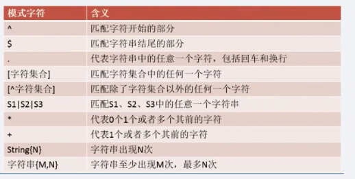

## 一、REGEXP '匹配方式'

## 二、常用匹配方式

	-- ^匹配字符开始的部分
	-- 查询用户名以h开始的用户
	SELECT * FROM cms_user WHERE username REGEXP '^h';
	
	-- $匹配字符串结尾的部分
	-- 查询用户名以g结尾的用户
	SELECT * FROM cms_user WHERE username REGEXP 'g$';
	
	-- .代表任意字符
	SELECT * FROM cms_user WHERE username REGEXP '.';
	SELECT * FROM cms_user WHERE username REGEXP 'l..g';
	SELECT * FROM cms_user WHERE username LIKE 'l__g';
	
	-- [字符集合] [lto] 用户名中只要包含中括号里面任意一个字符就会查询出来
	SELECT * FROM cms_user WHERE username REGEXP '[lto]';
	
	-- [^字符集合] 除了字符集合中的内容
	SELECT * FROM cms_user WHERE username REGEXP '[^lto]';
	SELECT * FROM cms_user WHERE username REGEXP '[^l]';
	
	INSERT cms_user(username,passwd,regTime,proId)
	VALUES("lll","lll",138998799,2),
	("ttt","lll",138998799,2),
	("ooo","lll",138998799,2);
	
	SELECT * FROM cms_user WHERE username REGEXP '[a-k]';
	SELECT * FROM cms_user WHERE username REGEXP '[^a-m]';
	
	SELECT * FROM cms_user WHERE username REGEXP 'ng|ua';
	
	
	SELECT * FROM cms_user WHERE username REGEXP 't*';
	SELECT * FROM cms_user WHERE username REGEXP 't+';
	
	-- e出现0次或者多次
	SELECT * FROM cms_user WHERE username REGEXP 'que*';
	-- e出现1次或者多次
	SELECT * FROM cms_user WHERE username REGEXP 'que+';
	-- e出现2次
	SELECT * FROM cms_user WHERE username REGEXP 'que{2}';
	
	SELECT * FROM cms_user WHERE username REGEXP 'que{3}';
	-- e最少出现一次，最多出现3次
	SELECT * FROM cms_user WHERE username REGEXP 'que{1,3}';
	
	
	
	INSERT cms_user(username,passwd,regTime,proId)
	VALUES("queen","lll",138998799,2);
