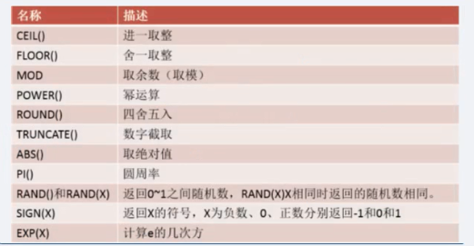
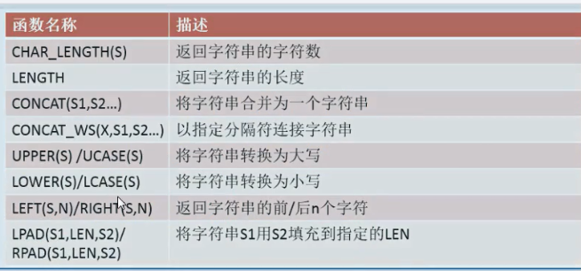
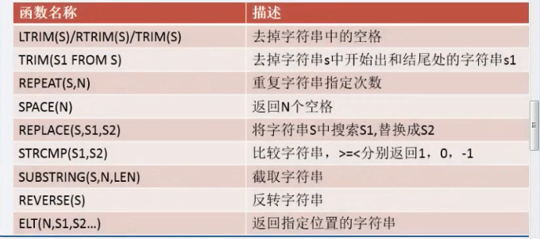
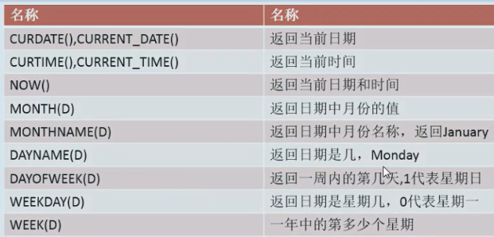
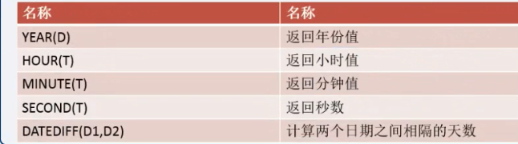
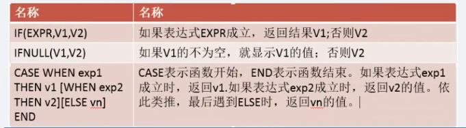
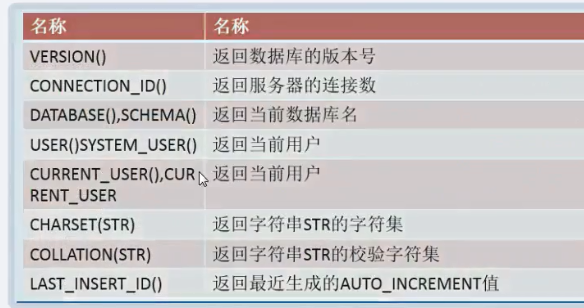
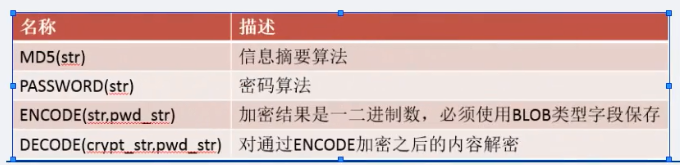
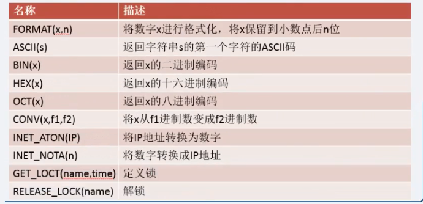

	SELECT VERSION();
	
	SELECT NOW();

## 1.数学函数

	SELECT num1,CEIL(num2),CEILING(num3) FROM test4;

## 2.字符串函数

## 3.日期时间函数

## 4.条件判断函数

	SELECT id,username,score,IF(score>=60,'及格','不及格') FROM student;
	
	SELECT id,username,score,CASE WHEN score=60 THEN '刚刚及格' WHEN score>60 THEN '挺好' ELSE '没及格' END FROM student;

## 5.常用系统函数

## 6.加密函数

	
	SELECT MD5('admin');

## 7.其他常用函数

**注意：** 

INET\_NOTA() 这个表中写错了，应该是INET_NTOA()
