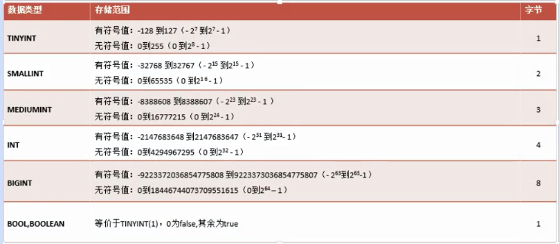
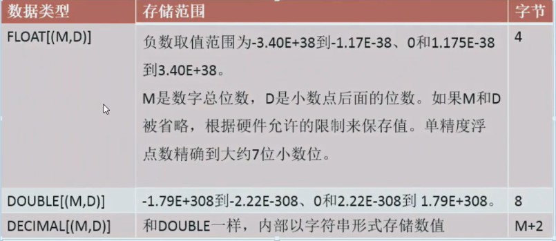
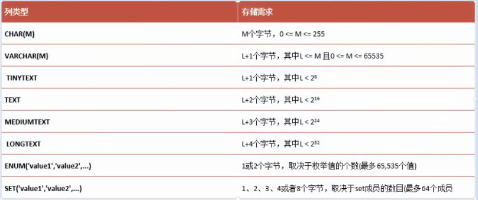

## 数据表相关操作

### MySql中的数据类型

#### 1. 整数类型

**tips:** 命令行中使用help等方式查看类型的取值范围

		
		help tinyint

		? INT

		\h INT

#### 2. 浮点类型

 
#### 3. 字符串类型

#### 4.日期时间类型

#### 5.二进制类型

用来保存一些图片视频等，但是使用很少，一般保存的是图片路径。