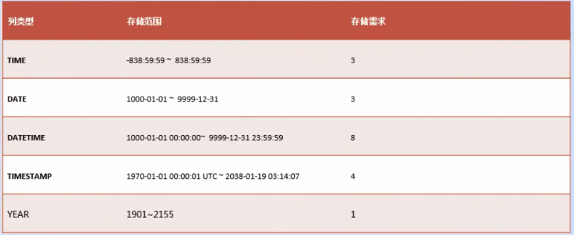

## 数据表相关操作

### 一、MySql中的数据类型

#### 1. 整数类型

**tips:** 命令行中使用help等方式查看类型的取值范围

		
		help tinyint

		? INT

		\h INT

#### 2. 浮点类型

 
#### 3. 字符串类型

#### 4.日期时间类型

#### 5.二进制类型

用来保存一些图片视频等，但是使用很少，一般保存的是图片路径。

### 二、MySql存储引擎

#### 1.什么是存储引擎

存储引擎就是指表的类型。数据库中的存储类型决定了表在计算机中的存储方式。用户可以根据不同的存储方式，是否进行事务处理等来选择合适的存储引擎。

#### 2.查看MySQL的存储引擎

##### 1）查看MySQL支持的存储引擎：

		SHOW ENGINES;
		SHOW ENGINES\G;

引擎信息说明：

		*************************** 1. row ***************************
      	Engine: InnoDB
     	Support: DEFAULT
     	Comment: Supports transactions, row-level locking, and foreign keys
		Transactions: YES
        XA: YES
  		Savepoints: YES
		*************************** 2. row ***************************

Engine:引擎名称

Support:是否支持该引擎，YES支持，NO不支持

Comment：存储引擎的一些特点说明

Transactions：是否支持事务处理

XA: 是否是分布式的一个交易

Savepoints：事务的一个保存点

**默认使用InnoDB**

##### 2)查看显示支持的存储引擎信息

	SHOW VARIABLES LIKE 'have%';

##### 3)查看默认的存储引擎

	SHOW VARIABLES LIKE 'storage_engine';

#### 3.MySQL常用存储引擎及特点

##### 1）InnoDB存储引擎

##### 2）MyISAM存储引擎

##### 3）MEMORY存储引擎

### 三、数据表操作

#### 1.创建数据表

	CREATE TABLE [IF NOT EXISTS] table_name(字段名称 字段类型[完整性约束条件]...)
	ENGINE=引擎名称 CHARSET='编码方式';

完整性约束条件：

-  PRIMARY KEY 主键
-  AUTO_INCREMENT 自增长
-  FOREIGN KEY 外键
-  NOT NULL 非空
-  UNIQUE KEY 唯一
-  DEFAULT 默认值

操作实例：

	# 注释内容
	-- 创建test数据库
	CREATE DATABASE IF NOT EXISTS `test` DEFAULT CHARACTER SET 'UTF8';
	--打开数据库
	USE test;
	-- 查看是否打开数据库
	SELECT DATABASE();
	
	-- 创建学员表（user）
	-- 编号 id
	-- 用户名 username
	-- 年龄 age
	-- 性别 sex
	-- 邮箱 email
	-- 地址 addr
	-- 生日 birth
	-- 薪水 salary
	-- 电话 tel
	-- 是否结婚  married
	
	-- 注意：当需要输入中文的时候，需要临时转换客户端的编码方式
	-- SET NAMES GBK;\s;
	
	-- 字段注释：通过 COMMENT 注释内容 给字段添加注释
	
	CREATE TABLE IF NOT EXISTS `user`(
	id SMALLINT,
	username VARCHAR(20),
	age TINYINT,
	sex ENUM('男','女','保密'),
	email VARCHAR(50),
	addr VARCHAR(200),
	birth YEAR,
	salary FLOAT(8,2),
	tel INT,
	married TINYINT(1) COMMENT '0代表未婚，非0代表已婚'
	)ENGINE=INNODB CHARSET=UTF8;

**注意点：**

- 注释标志： '#' 或者 '--'
- 当需要输入中文的时候，需要临时转换客户端的编码方式
	
		SET NAMES GBK;
		\s; #查看当前编码方式

- 字段注释：通过 COMMENT 注释内容 给字段添加注释

测试主键：

	-- 测试主键
	CREATE TABLE IF NOT EXISTS user1(
	id INT PRIMARY KEY,
	username VARCHAR(20)
	);
	DESC user1;
	INSERT user1 VALUES(1,'testname');
	SELECT * FROM user1;

测试自增长：

	-- 测试自增长
	CREATE TABLE IF NOT EXISTS user3(
	id SMALLINT KEY AUTO_INCREMENT,
	username VARCHAR(20)
	);
	INSERT user3 VALUES(1,"king");
	INSERT user3(username) VALUES("king1");
	INSERT user3 VALUES(DEFAULT, "king2");
	INSERT user3 VALUES(NULL, "king3");
	
	CREATE TABLE IF NOT EXISTS user4(
	id SMALLINT KEY AUTO_INCREMENT,
	username VARCHAR(20)
	)AUTO_INCREMENT=100;
	INSERT user4(username) VALUES("KING");
	
	-- 修改自增长的值
	ALTER TABLE user4 AUTO_INCREMENT = 300;
	INSERT user4(username) VALUES("KING300");

**注意： 自增长一定要配合主键使用**

测试DEFAULT:

	-- 测试DEFAULT
	CREATE TABLE IF NOT EXISTS user5(
	id INT UNSIGNED KEY AUTO_INCREMENT,
	username VARCHAR(20) NOT NULL,
	age TINYINT UNSIGNED DEFAULT 18,
	addr VARCHAR(50) NOT NULL DEFAULT '北京',
	sex ENUM('男','女','保密') NOT NULL DEFAULT '男'
	);
	INSERT user5(username,addr) VALUES('king', '上海');

测试唯一：

	-- 测试唯一
	CREATE TABLE IF NOT EXISTS user6(
	id TINYINT UNSIGNED KEY AUTO_INCREMENT,
	username VARCHAR(20) NOT NULL UNIQUE,
	card CHAR(18) UNIQUE
	);

**注意：一个表中有一个主键，可以有多个唯一，多个NULL值不算重复**

查看创建表的定义：
	
	SHOW CREATE TABLE user1;

#### 2.查看数据库中的数据表及结构

##### 1）查看数据表

	SHOW TABLES;  

创建一个表就是在数据库目录下创建了一个文件，可以到

	D:\ProgramData\MySQL\MySQL Server 5.7\Data\test

下查看

##### 2）查看指定表的表结构

	DESC table_name;
	DESCRIBE table_name;
	SHOW COLUMNS FROM tbl_name;

#### 3.修改表结构

##### 1）修改表名

	ALTER TABLE tbl_name RENAME [TO|AS] new_name;
	RENAME tbl_name TO new_name;

测试：
	
	ALTER TABLE user5 RENAME TO reuser1;
	ALTER TABLE user4 RENAME AS user44;
	ALTER TABLE user3 RENAME user33;
	RENAME TABLE user1 TO user11;

##### 2）添加字段

	ALTER TABLE table_name ADD 字段名称 字段类型[完整性约束条件][FIRST|AFTER 字段名称]

实例：
	
	ALTER TABLE user6 ADD addr VARCHAR(50);
	ALTER TABLE user6 ADD addr1 VARCHAR(50) NOT NULL UNIQUE;
	ALTER TABLE user6 ADD addr2 VARCHAR(50) NOT NULL UNIQUE FIRST;
	ALTER TABLE user6 ADD card3 INT NOT NULL DEFAULT 100 AFTER username;
	
	-- 选中一次表，完成多个操作
	ALTER TABLE user6
	ADD test1 INT NOT NULL DEFAULT 128 AFTER card,
	ADD test2 FLOAT(6,2) FIRST,
	ADD test3 SET('A','B','C');

##### 3)删除字段

	ALTER TABLE table_name DROP 字段名称;

实例：

	ALTER TABLE user6 DROP test1;

	-- 一次删除多个字段
	ALTER TABLE user6
	DROP test2,
	DROP test3,
	DROP card3;
	
	-- 添加一个字段，删除一个字段
	ALTER TABLE user6 ADD test1 INT NOt NULL DEFAULT 22 UNIQUE AFTER card,
	DROP addr2;
	
##### 4)修改字段

	ALTER TABLE table_name MODIFY 字段名称 字段类型[完整性约束条件] [FIRST|AFTER 字段名称];

实例：
	
	ALTER TABLE user6 MODIFY addr VARCHAR(200);
	ALTER TABLE user6 MODIFY addr VARCHAR(70) NOT NULL DEFAULT '北京';
	ALTER TABLE user6 MODIFY addr VARCHAR(70) AFTER username; 

##### 5）修改字段名称

	ALTER TABLE table_name CHANGE 旧字段名称 新字段名称 字段类型[完整性约束条件] [FIRST|AFTER 字段名称];

实例：

	ALTER TABLE user6 CHANGE addr address VARCHAR(300) NOT NULL;

##### 6）添加默认值

	ALTER TABLE table_name ALTER 字段名称 SET DEFAULT 默认值;

##### 7)删除默认值

	ALTER TABLE table_name ALTER 字段名称 DROP DEFAULT;

##### 8)添加主键

	ALTER TABLE table_name ADD [CONSTRAINT [symbol]] PRIMARY KEY[index_type](字段名称,...);

实例：

	CREATE TABLE IF NOT EXISTS test(
	id INT
	);
	ALTER TABLE test ADD PRIMARY KEY(id);
	
	CREATE TABLE IF NOT EXISTS test1(
	id INT
	);
	ALTER TABLE test1
	ADD username VARCHAR(50),
	ADD card CHAR(18);
	ALTER TABLE test1 ADD PRIMARY KEY(id,card);
	
	ALTER TABLE test DROP PRIMARY KEY;
	ALTER TABLE test ADD CONSTRAINT symbol PRIMARY KEY index_type(id);

##### 9)删除主键

	ALTER TABLE table_name DROP PRIMARY KEY;

##### 10)添加唯一

	ALTER TABLE table_name ADD [CONSTRAINT [symbol]] UNIQUE[INDEX|KEY][索引名称](字段名称,...);

实例：

	ALTER TABLE test ADD UNIQUE(username); 
	ALTER TABLE test ADD CONSTRAINT symbol UNIQUE KEY uni_card(card);

##### 11）删除唯一

	ALTER TABLE table_name DROP {INDEX|KEY} index_name;

##### 12）修改表的存储引擎

	ALTER TABLE table_name ENGINE=存储引擎名称;

##### 13)设置自增长的值

	ALTER TABLE table_name AUTO_INCREMENT=值;

#### 4.删除数据表

	DROP TABLE [IF EXISTS] table_name[,table_name...];

实例：

	DROP TABLE user44;
	DROP TABLE user11,user2,user33;