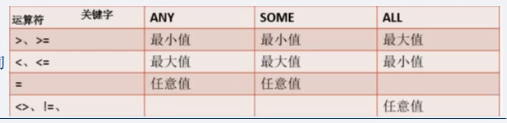

## 一、什么是子查询

子查询是将一个查询语句嵌套在另一个查询语句中。内层查询语句的查询结果，可以作为外层查询语句提供条件。
在含有子查询的语句中一定是先执行子查询，由内向外执行。

## 二、引发子查询的情况

### 1.使用[NOT]IN 的子查询
	
	-- 由[NOT] IN 引发的子查询
	SELECT id FROM department;
	SELECT id,username FROM employee WHERE depId IN (1,2,3,4);
	
	SELECT id,username FROM employee WHERE depId IN (SELECT id FROM department);
	
	-- 插入垃圾数据
	INSERT employee(username,depId) VALUES("testtest",8);
	SELECT id,username FROM employee WHERE depId NOT IN (SELECT id FROM department);

### 2.使用比较运算符的子查询 

	=,>,<,>=,<=,<>,!=,<=>
	
实例：

	-- 创建学员表student
	-- id,username,score
	CREATE TABLE IF NOT EXISTS student(
	id TINYINT UNSIGNED AUTO_INCREMENT KEY,
	username VARCHAR(20) NOT NULL UNIQUE,
	score TINYINT UNSIGNED
	);
	
	INSERT student(username,score) VALUES("king",90),
	("king1",10),
	("king2",20),
	("king3",30),
	("king4",40),
	("king5",50),
	("king6",60),
	("king7",70),
	("king8",80),
	("king9",100);
	
	-- 创建奖学金表scholarship
	-- id,level
	CREATE TABLE IF NOT EXISTS scholarship(
	id TINYINT UNSIGNED AUTO_INCREMENT KEY,
	level TINYINT UNSIGNED
	);
	
	INSERT scholarship(level) VALUES(90),(80),(70);
	
	
	-- 查询获得一等奖学金的学员
	SELECT level FROM scholarship WHERE id=1;
	SELECT id,username FROM student WHERE score>=90;
	
	SELECT id,username FROM student WHERE score>=(SELECT level FROM scholarship WHERE id=1);

### 3.使用[NOT]EXISTS的子查询

EXISTS:如果子查询结果为真，则外层语句执行，否则不执行

	-- 查询部门表
	SELECT * FROM department WHERE id=5;
	-- 查询结果为空
	SELECT id,username FROM employee WHERE EXISTS(SELECT * FROM department WHERE id=5);
	-- 正常查询
	SELECT id,username FROM employee WHERE EXISTS(SELECT * FROM department WHERE id=4);
	
	SELECT id,username FROM employee WHERE NOT EXISTS(SELECT * FROM department WHERE id=41);

### 4.使用ANY|SOME或者ALL的子查询

	
	-- 查询所有获得奖学金的学员
	SELECT id,username,score FROM student WHERE score>=ANY(SELECT level FROM scholarship);
	SELECT id,username,score FROM student WHERE score>=SOME(SELECT level FROM scholarship);
	
	-- 查询所有学员中获得一等奖学金的学员
	SELECT id,username,score FROM student WHERE score>=ALL(SELECT level FROM scholarship);
	
	-- 查询没有获取奖学金的学员
	SELECT id,username,score FROM student WHERE score<ALL(SELECT level FROM scholarship);
	
	-- 相当于 IN 
	SELECT id,username,score FROM student WHERE score=ANY(SELECT level FROM scholarship);
	SELECT id,username,score FROM student WHERE score IN (SELECT level FROM scholarship);
	
	-- 相当于NOT IN
	SELECT id,username,score FROM student WHERE score NOT IN (SELECT level FROM scholarship);
	-- <>：不等于
	SELECT id,username,score FROM student WHERE score <>ALL(SELECT level FROM scholarship);

## 三、将查询结果写入到数据表
	
	INSERT [INTO] tbl_name [(col_name,...)] 
	SELECT ...

实例：

	CREATE TABLE test1(
	id TINYINT UNSIGNED AUTO_INCREMENT KEY,
	num TINYINT UNSIGNED
	);
	
	INSERT test1(id,num)
	SELECT id,score FROM student;

## 四、创建数据表同时将查询结果写入到数据表

	CREATE TABLE [IF NOT EXISTS] tbl_name [create_defination,...] 
	select_statement

实例：
		
	CREATE TABLE test2(
	id TINYINT UNSIGNED AUTO_INCREMENT KEY,
	num TINYINT UNSIGNED
	)SELECT id,score FROM student;
	
	DESC test2;
	
	CREATE TABLE test3(
	id TINYINT UNSIGNED AUTO_INCREMENT KEY,
	score TINYINT UNSIGNED
	)SELECT id,score FROM student;